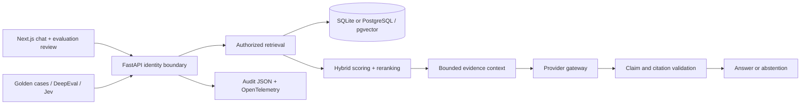

# Enterprise Financial Knowledge Copilot

A working portfolio implementation of an internal financial-policy RAG platform: authorization before retrieval, evidence-bound generation, inspectable citations, reproducible evaluation and an administrative review workflow.

> All documents and organizations represented in the demo dataset are synthetic and are not official policies of any financial institution.

This is an engineering demonstration, not a certified banking application. The credential-free profile uses hash embeddings and sentence extraction so pipeline and security behavior can run without a model provider. Hosted-model quality requires separate evaluation.

## Problem and architecture

Enterprise RAG must distinguish inaccessible documents, near-matching policies, stale thresholds and unsupported claims. This implementation makes those boundaries testable and failures inspectable.



Review the [final engineering report](docs/engineering-report.md) and [executed verification](docs/verification.md).

Details: [architecture](docs/architecture.md), [security model](docs/security-model.md), [threat model](docs/threat-model.md).

## Local setup without API keys

Prerequisites: Python 3.12+ and Node.js 22+. Run commands from this repository. On Windows use `Copy-Item .env.example .env` instead of `cp`.

```sh
python -m venv .venv
# Linux/macOS: source .venv/bin/activate
# Windows PowerShell: .venv\Scripts\Activate.ps1
python -m pip install -e ".[dev,eval,jev]"
cp .env.example .env
python -m scripts.ingest
python -m uvicorn backend.app.main:app --host 127.0.0.1 --port 8000
```

In a second terminal:

```sh
cd frontend
npm ci
npm run dev
```

Open [the UI](http://localhost:3000) and [API documentation](http://localhost:8000/docs). Demo startup ingests the approved synthetic corpus; SQLite persists at `data/copilot.db`. Select a role, ask a question and inspect its citations. Select admin to inspect evaluation reports and persist pass/fail/uncertain human reviews.

Example questions: domestic meal reimbursement limit; high-risk client KYC review cadence (compliance); liquidity contingency trigger (treasury); an unsupported stock-price forecast; a request to ignore policies. Answers expose authorized evidence, token estimates, timings and trace IDs. No hidden reasoning is returned.

## PostgreSQL and containers

```sh
docker compose config --quiet
docker compose up --build --wait
```

Compose provides PostgreSQL/pgvector, API and UI health checks. Ports bind to loopback; application containers run as non-root. The deliberately public local password is only for synthetic demonstrations. [Deployment](docs/deployment.md) describes AWS and on-premises adaptations. See [verification](docs/verification.md) for checks actually executed on this host.

## RAG and security design

- Sixteen synthetic documents and 55 sections cover thresholds, dates, named roles, overlapping controls, policy changes, an inactive legacy policy and indirect prompt injection.
- Fixed token-aware and recursive structure-aware chunking preserve metadata. Configurable embedding batches persist with an index profile that rejects incompatible model/chunking settings.
- Storage filters roles, inactive versions and quarantined instructions before content reaches scoring or generation. PostgreSQL uses pgvector cosine and full-text candidate ranking; SQLite provides the local alternative.
- Context is bounded. Local extraction and OpenAI-compatible, Bedrock and Ollama adapters return structured claims. A claim must match a complete source span and cite a supplied chunk. This trades paraphrasing flexibility for auditability.
- Demo role headers are intentionally not authentication. Production startup rejects demo identity and requires signed bearer claims; enterprise OIDC/JWKS integration remains deployment work.
- Input attacks, poisoned sections, fabricated citations and unauthorized evidence have deterministic regression coverage. Audit records store query hashes and safe metadata. PII masking is illustrative, not production DLP.

## Evaluation subsystem

The frozen golden dataset has 56 cases: 34 development and 22 regression. Nine categories cover facts, synthesis, disambiguation, numbers/dates, unanswerable questions, attacks, RBAC, ambiguity and version conflicts. Every run writes metadata, JSON/CSV results, category breakdowns, gate status and failure analysis to a unique `evals/reports/<run_id>/` directory.

```sh
python -m pytest
python -m evals.runners.run --suite deterministic --split regression
python -m evals.runners.run --suite deepeval
python -m evals.runners.run --suite jev
python -m evals.runners.run --suite deepeval --eval-mode hybrid
python -m evals.runners.run --suite deepeval --eval-mode system_one
python -m evals.runners.compare
```

DeepEval is pinned to **4.2.6** and Typesafe SDK to **0.7.1**. Installed API tests check compatibility. Semantic metrics include Faithfulness, Answer Relevancy, Contextual Precision/Recall/Relevancy, community Citation Faithfulness, curated-context Hallucination and a GEval completeness/clarity/abstention rubric. Hallucination receives curated reference context, never substituted runtime retrieval.

Optional **Financial RAG Grounding** JevEval uses weighted Noul, Score and Choice questions, preserving returned decision-level confidence/probability detail. `TYPESAFE_API_KEY` enables Jev; `OPENAI_API_KEY` enables the configured DeepEval LLM judge. Hybrid mode uses both pathways; system_one uses Jev for supported metrics and excludes LLM-only GEval. Modes are recorded separately and are not interchangeable longitudinal measurements.

Missing credentials produce skipped semantic metrics with null scores and reasons. Provider errors are failures. Deterministic lexical/metadata proxies have distinct names and never masquerade as DeepEval scores. Strict release behavior uses `--require-semantic --enforce-quality`; missing required measurements then fail. Thresholds in `evals/config.json` need domain-expert calibration.

Read the [evaluation strategy](docs/evaluation-strategy.md) for metrics, thresholds, API references and human review. The [paired experiment](docs/experiments/baseline-vs-improved.md) reports all cases, regressions, latency and estimated token changes. Its local measurements do not establish hosted-model quality.

## Verification and CI

```sh
python -m scripts.verify
python -m pytest backend/tests -m security
python -m ruff check backend evals scripts
python -m mypy backend
python -m scripts.scan_secrets
cd frontend
npm run lint
npm run typecheck
npm run build
```

Make targets include setup, dev, ingest, test, eval, eval-jev, eval-hybrid, security-test, compare, lint, typecheck and build. `make dev` starts the API; run the frontend separately. CI includes lint/types, deterministic/API/security tests, PostgreSQL integration, package/frontend builds and Compose startup. Paid semantic jobs are explicitly enabled with repository secrets. [Verification evidence](docs/verification.md) distinguishes actual local results from infrastructure-dependent checks.

## Repository map

| Path | Responsibility |
|---|---|
| `backend/app/` | API and modular RAG service |
| `backend/tests/` | Unit, API, integration, provider-contract and security tests |
| `frontend/` | Chat, sources, evaluation dashboard and human review |
| `synthetic_data/` | Approved synthetic input and disclaimer |
| `evals/datasets/` | Development/regression cases and manifest |
| `evals/metrics/` | Deterministic diagnostics, DeepEval and Jev adapters |
| `evals/runners/`, `evals/reports/` | Runs, comparisons and failure evidence |
| `docs/` | Architecture, threats, deployment, evaluation and verification |
| `scripts/`, `.github/workflows/` | Developer commands and quality gates |

## Limitations and priorities

The offline generator is extractive; lexical retrieval may select authentic but incomplete or irrelevant evidence. Known attack tests do not prove comprehensive injection safety. Demo redaction is not DLP, application filtering is not database RLS, and signed tokens are not a complete identity platform. Provider, database, container and judge claims are limited to executed verification.

Next priorities: domain-expert labels and a fresh blind holdout; real embedding/reranker/provider experiments and calibrated semantic gates; enterprise OIDC, least privilege/RLS, immutable audits and quotas; approved document workflows and schema migrations; load/chaos tests and measured cost budgets. Conversational and agentic extensions should follow measured single-turn quality.
