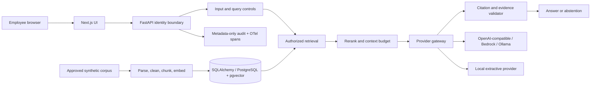
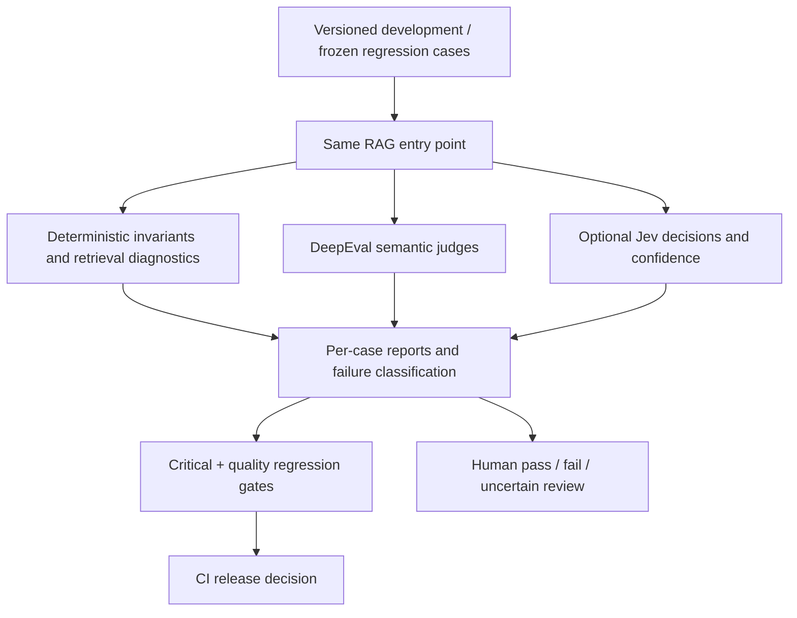

# Architecture and engineering decisions

This portfolio implements an executable single-turn RAG service, a synthetic policy corpus, and an evaluation system. It deliberately offers two operating profiles: a credential-free SQLite/hash-embedding/extractive profile for reproducible tests, and PostgreSQL/pgvector with interchangeable model and embedding providers for deployment integration. Results from those profiles must not be treated as interchangeable quality measurements.

## Ingestion

The canonical JSON holds section text plus title, document ID/version, source URI, classification, allowed roles, effective date and active status. Inactive documents are excluded from current retrieval. Structure-aware chunking preserves section boundaries and bounded overlap; a fixed-size configuration is available for the baseline experiment. Embeddings and complete chunk metadata persist together. A full reingestion is necessary when embedding model/dimensions or chunking changes. Semantic chunking is intentionally deferred until its benefit is measured.

## Query flow and evidence contract

1. Resolve identity at the API boundary; reject unknown roles and invalid requests.
2. Check input for known instruction attacks and preprocess the query.
3. Apply role authorization to the candidate set before any similarity scoring, ranking or model context assembly.
4. Combine vector and keyword relevance, optionally rerank, apply a score threshold, and bound context size.
5. Send system instructions separately from the delimited, untrusted evidence payload.
6. Require cited evidence to refer to supplied chunks and reject unsupported/invalid claims. Return an explicit abstention for empty or insufficient evidence.
7. Return only the answer, authorized citations/context and safe operational metadata. No chain-of-thought is returned.

The local generator extracts supported sentences; it is useful for invariant tests and offline comparisons, but is not evidence of the semantic quality of a hosted LLM. Conservative quote validation trades fluency and synthesis coverage for auditability. A quote can be authentic yet irrelevant: retrieval evaluation and domain-expert review address that distinct failure mode.

## Storage and operational boundaries

The store persists chunks, embeddings, traces and human review labels through SQLAlchemy. SQLite provides the no-service local path. PostgreSQL uses pgvector plus full-text retrieval; role authorization remains in the storage query. Application filtering alone is not a substitute for database RLS when independently accessed database clients are introduced.

Providers expose small interfaces. Domain/retrieval code does not import vendor SDKs. Model names, embedding dimensions, thresholds, context limits and prices are configuration. External API keys stay in environment settings and never appear in browser code or reports. Local token counts are estimates; external provider-reported usage takes precedence when available. Cost uses explicitly configured per-million-token rates, not assumed current vendor prices.

## Evaluation and change control

The experiment runs the same development set against both configurations. Frozen regression cases are not used to tune prompts. Run manifests identify data, prompt, model, chunking, retrieval settings, judge mode and commit. Missing judge credentials produce explicit skipped semantic measurements, never synthetic scores under DeepEval labels.

## Observability and scale limits

Request, preprocessing, retrieval, reranking, generation, guardrail and citation timings are separate. Audit records store role, query hash, retrieved IDs, provider/model, token usage, decisions and abstention. OpenTelemetry spans can be connected to an organization's collector. Before scaling, add migration/version governance, asynchronous ingestion, index/recall benchmarking, per-user quotas, immutable audit retention and independently operated identity integration.
