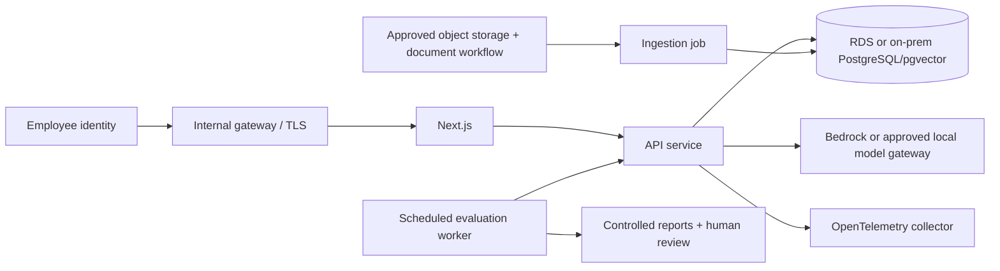

# Deployment and portability

## Local profiles

The direct local profile runs Python, SQLite and Node.js without credentials. The Docker Compose profile runs PostgreSQL 17 with pgvector, the Python API and the Next.js standalone server. Compose ports bind to loopback. The database has no published host port. `local-demo-only` is a deliberately public local demonstration password, not a secret or production default to reuse.

```sh
cp .env.example .env
docker compose config --quiet
docker compose up --build --wait
# UI http://localhost:3000, API http://localhost:8000/docs
docker compose down
```

The backend waits for PostgreSQL health; frontend waits for API readiness. Backend startup ingests the approved synthetic corpus in demo mode. Docker named volumes preserve database state; a normal `down` does not delete it. Reports generated on the host mount read-only into the API. Run evaluation jobs separately from serving traffic. Before changing the PostgreSQL password in a populated volume, rotate it in PostgreSQL too.

Container configuration is executable infrastructure, but configuration validation alone does not demonstrate successful image builds or live PostgreSQL behavior. See `verification.md` for what ran on the implementation host and the CI workflow for container integration checks.

## Provider configuration

| Deployment | Generation | Embeddings | Persistence | Operational services |
|---|---|---|---|---|
| Local no-key demo | Extractive local provider | Deterministic hashed bag of words | SQLite | Local JSON audit + per-stage timing |
| AWS | Bedrock Converse adapter or approved OpenAI-compatible endpoint | Approved embedding endpoint | RDS PostgreSQL with pgvector | IAM, Secrets Manager, encrypted backups, OTel/CloudWatch |
| On-premises | Ollama chat endpoint or OpenAI-compatible local gateway | Optional sentence-transformer or approved endpoint | PostgreSQL with pgvector | Internal identity, S3-compatible store, OTel collector |



Object storage and cloud telemetry are target deployment integrations, not provisioned resources. The working ingestion source is the canonical repository corpus. No cloud account, real bank documents or deployment is required.

## Before a production rollout

Set `APP_ENV=production`, `DEMO_AUTH_ENABLED=false`, `AUTO_INGEST=false` and a high-entropy `AUTH_TOKEN_SECRET`. The included signed bearer-token boundary demonstrates integrity, expiry, issuer/audience validation and server-resolved roles. Replace token issuance with the enterprise identity provider and verify OIDC/JWKS claims, revocation and group ownership. Never enable the browser's demo role selector as production identity.

Use a dedicated application database role and an independently controlled ingestion/migration role. Enable transport/storage encryption, private subnets, managed secrets, role-level audit review, backup restore drills, migration rollback and data-retention jobs. The demo's application authorization is not a substitute for database RLS or network controls. Deploy a rate-limiting gateway and model quotas; calibrate runtime concurrency and provider timeouts against measured load.

Bedrock credentials should use a workload IAM role; do not bake access keys into images. On-prem endpoints should use authenticated TLS and an allowlisted network route. Set provider models and embedding dimensions explicitly and reingest after an embedding change. Hash and sentence-transformer vectors must not share an index without a full replacement.

## Cost and latency

The gateway reports provider token usage when available; the local path uses an explicit estimate. Set input/output prices from the institution's actual provider contract. Zero defaults do not imply a hosted model is free. A smaller context and reranker top-K can reduce input tokens but may lower evidence recall. Hybrid retrieval and reranking add CPU work; the recorded experiment measures that trade-off for this synthetic corpus. External API latency, embedding generation, cold starts and concurrency will change those results.

## Failure handling

Provider failures must produce sanitized errors/abstention and an audit decision. `/health` checks process liveness; `/ready` checks database/index readiness. An application can be healthy while a model provider is unavailable. Add dependency-specific SLOs, circuit breakers and backlog monitoring for deployment. Use model-risk-approved rollback versions for prompt, corpus, embedding model and retrieval settings together.
